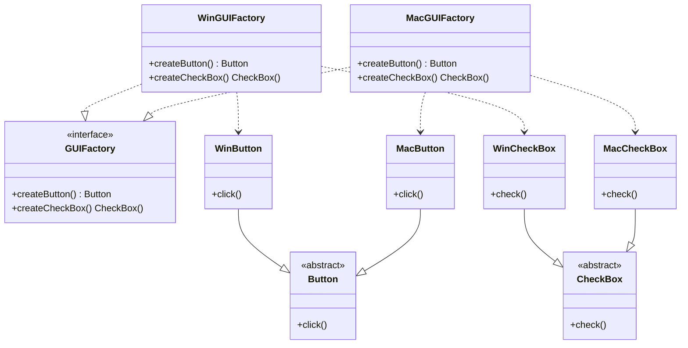

```mermaid
classDiagram
class GUIFactory{
    <<interface>>
    +createButton() Button
    +createCheckBox() CheckBox()
}

class WinGUIFactory{
    +createButton() Button
    +createCheckBox() CheckBox()
}

class MacGUIFactory{
    +createButton() Button
    +createCheckBox() CheckBox()
}

class Button{
    <<abstract>>
    +click()
}

class CheckBox{
    <<abstract>>    
    +check()
}

class MacButton{
    +click()
}

class WinButton{
    +click()
}

class MacCheckBox{
    +check()
}
class WinCheckBox{
    +check()
}

WinGUIFactory ..|> GUIFactory
MacGUIFactory ..|> GUIFactory
WinGUIFactory ..> WinButton
WinGUIFactory ..> WinCheckBox
MacGUIFactory ..> MacButton
MacGUIFactory ..> MacCheckBox
WinButton --|> Button
WinCheckBox --|> CheckBox
MacButton --|> Button
MacCheckBox --|> CheckBox
```
